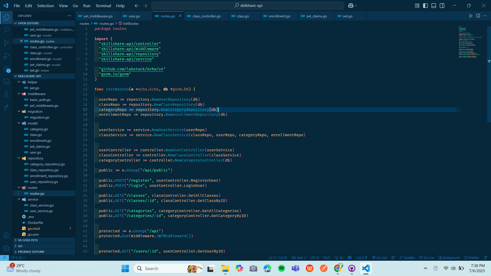

# 🧠 SkillShare API

Platform backend sederhana namun powerful untuk berbagi keterampilan dan kursus singkat. Dirancang agar pengembang dapat dengan mudah membangun sistem pelatihan online atau aplikasi komunitas pembelajaran interaktif.

---

## 🎯 Fitur Unggulan

- 🔐 **Registrasi & Login** dengan otentikasi JWT
- 📚 **Manajemen Kelas (CRUD)**: Buat, ubah, hapus, dan tampilkan kelas keterampilan
- 👤 **Pendaftaran Kelas**: Pengguna dapat mendaftar atau membatalkan kelas
- 🔒 **JWT Protected Routes** dengan Bearer Token
- 🗃️ **Database Relasional** dengan GORM + PostgreSQL

---

## 📽️ Video Presentasi

Klik gambar di bawah untuk menonton demo lengkap aplikasi SkillShare API:

---

## 🧱 Teknologi yang Digunakan

| Teknologi     | Deskripsi                                                            |
|---------------|----------------------------------------------------------------------|
| **Go**        | Bahasa utama untuk backend API                                       |
| **Echo**      | Web framework ringan untuk RESTful API                               |
| **GORM**      | ORM untuk PostgreSQL dan pengelolaan entitas                         |
| **PostgreSQL**| Basis data relasional                                                |
| **JWT**       | JSON Web Token untuk otorisasi pengguna                              |
| **Godotenv**  | Untuk membaca file `.env` secara otomatis                            |

---

## 🧭 Struktur API (Endpoint Utama)

| Metode | Endpoint                  | Deskripsi                             | Proteksi |
|--------|---------------------------|---------------------------------------|----------|
| POST   | `/register`               | Daftarkan pengguna baru               | ❌       |
| POST   | `/login`                  | Login dan dapatkan token JWT          | ❌       |
| GET    | `/skills`                 | Ambil daftar kelas                    | ✅       |
| POST   | `/skills`                 | Buat kelas baru                       | ✅       |
| PUT    | `/skills/:id`             | Perbarui kelas                        | ✅       |
| DELETE | `/skills/:id`             | Hapus kelas tertentu                  | ✅       |
| POST   | `/skills/:id/enroll`      | Daftar ke kelas                       | ✅       |
| POST   | `/skills/:id/unenroll`    | Batalkan pendaftaran                  | ✅       |

---

## 📸 Galeri API & Routing

### 🔐 Otentikasi

**POST /register**

**POST /login**

---

### 📚 Manajemen Kelas

**POST /skills**  

**PUT /skills/:id**  

**DELETE /skills/:id**  

---

### 🛡️ Otentikasi Bearer Token

Gunakan token JWT sebagai Bearer Token di header authorization.

---

### 📌 Struktur Routing & Main

**Routes File**

**main.go**

---
